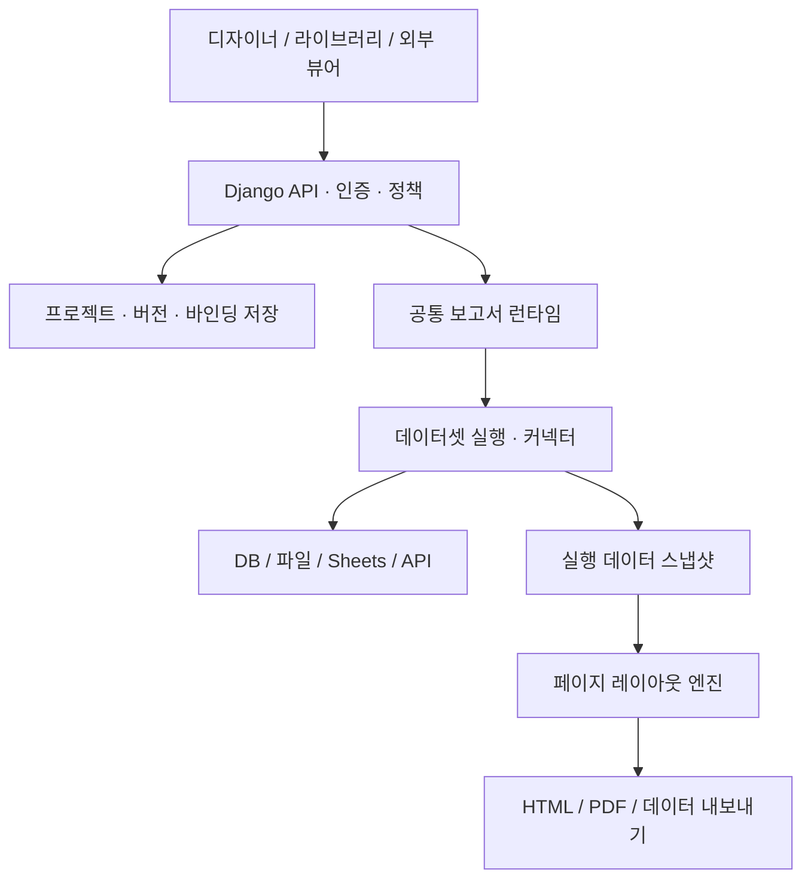

# 독립형 오픈소스 웹 레포트 빌더 기술명세서

| 항목 | 내용 |
|---|---|
| 문서 버전 | 1.0 |
| 작성일 | 2026-10-01 (Asia/Seoul) |
| 문서 상태 | 개발 착수 전 검토용 기술명세 |
| 프로젝트 가칭 | Open Web Report Builder (OWRB) — 정식 제품명·패키지명은 배포 전 결정 |
| 제품 형태 | Django 기반 독립 웹서비스 + 재사용 가능한 런타임/연동 패키지 |
| 배포 목표 | 누구나 설치·수정·재배포 가능한 오픈소스 |
| 원본 참고 | `hr_core_web_report_builder_spec_v1.1(2).md` |
| 작성 역할 | 오픈소스 웹 리포팅 설계자 |

> 이 문서는 구현 결과가 아니라 구현할 기능, 데이터 계약, 운영 방식, 검증 기준을 정의한다. HR Core의 사용자·메뉴·업무 모델에 대한 의존성을 제거하고 독립 제품으로 재설계한다. 사용자가 명세를 검토한 뒤 개발을 시작한다.

## 1. 목표와 설계 원칙

### 1.1 제품 목표

Excel, Access, Oracle, Microsoft SQL Server, MariaDB, Google Sheets 등 다양한 자료를 연결하여 테이블·필드 정보를 분석하고, 사용자가 필드를 클릭하거나 드래그하여 보고서 양식을 만들 수 있는 웹서비스를 제공한다.

만든 보고서는 독립 서비스에서 실행하거나 다른 웹서비스에 임베드할 수 있다. 편집 가능한 프로젝트 파일로 내보낸 뒤 다른 설치 환경에 가져와 그 환경의 DB·파일·API에 다시 연결할 수 있어야 한다.

### 1.2 핵심 원칙

1. **독립성:** HR Core 설치, HR 모델, HR 메뉴 시스템이 없어도 서비스가 동작한다.
2. **확장성:** 커넥터 플러그인을 추가하여 새 DB·파일·API 자료원을 지원한다.
3. **시각적 작성:** 자유배치 페이지와 반복 데이터 영역을 함께 지원한다.
4. **이식성:** 보고서 디자인과 논리 데이터 계약을 실제 연결정보·물리 컬럼 매핑으로부터 분리한다.
5. **공통 실행:** 디자이너 미리보기, 라이브러리 실행, 외부 임베드, PDF 생성이 같은 정의·권한·레이아웃 엔진을 사용한다.
6. **조회 전용:** 기본 기능은 원본 데이터에 쓰기 작업을 하지 않는다.
7. **안전한 공유:** 프로젝트 기본 내보내기에 비밀번호·토큰·원본 데이터·사용자 권한을 포함하지 않는다.
8. **명시적 지원:** 실제 검증한 커넥터·드라이버·DB 버전·파일 범위만 지원 목록에 표시한다.

### 1.3 ‘모든 자료 연결’의 구현상 의미

모든 자료원을 하나의 드라이버로 즉시 읽는 것은 보장할 수 없다. 이 요구사항은 **표준 커넥터 계약을 통해 연결 대상을 계속 확장할 수 있는 구조**와 **대표 자료원의 정식 지원**으로 구현한다.

지원되지 않는 자료원도 REST/JSON, CSV, 호스트 데이터 공급자 또는 신규 커넥터를 통해 연결할 수 있도록 한다. 데이터 접근 권한, 서버 네트워크 경로, 드라이버 설치와 라이선스, 실제 파일 형식은 자료원별 전제조건이다.

‘플러그인 추가 가능’과 ‘실제 검증 완료’를 구분한다. 테스트하지 않은 DB를 지원 완료로 표시하지 않는다.

### 1.4 사실과 설계안의 구분

| 구분 | 문서에서의 의미 |
|---|---|
| 확인 사실 | 공식 제품 문서·공식 저장소에서 확인한 외부 기능 또는 제약. `[Sxx]` 근거 표기 |
| 설계 결정안 | 본 제품에서 채택할 아키텍처와 동작 규칙. 구현 및 검증 전 상태 |
| 검증 목표 | 성능·정확성·호환성의 개발 수용 기준. 현재 달성한 수치가 아님 |
| 확장 범위 | 초기 정식 릴리스 이후 기능. 초기 지원과 구별 |

첨부파일은 이름에 v1.1이 있지만 본문 버전이 `Ver 1.0 Rev.1`로 기재되어 있다. 이 문서는 파일명만으로 원본 버전을 추정하지 않고 실제 내용을 참고했다.

## 2. 기존 명세에서의 변경

| 기존 HR 전용 설계 | 독립형 설계 |
|---|---|
| HR Core 내부 PostgreSQL 중심 | DB·파일·스프레드시트·API 커넥터 |
| 허용된 테이블에서 출력 컬럼 순서 지정 | 스키마 탐색 + 논리 데이터셋 구성 + 페이지 자유배치 |
| 자유배치·문서 디자이너 제외 | 텍스트·이미지·표·밴드·다중 페이지 디자이너 필수 |
| HR 사용자·그룹·메뉴 권한 재사용 | 독립 인증/RBAC + 호스트 인증 연동 |
| Django ORM 조회 중심 | 내부 메타 DB는 ORM, 외부 SQL 데이터원은 SQLAlchemy Core/드라이버 어댑터 |
| HR 메뉴에 ReportDefinition 연결 | 독립 라이브러리·게시 URL·iframe·API·Django 연동 |
| 정의 JSON을 HR DB에 저장 | 버전 있는 프로젝트 포맷 + 환경별 바인딩 분리 |
| XLSX/CSV 조회 결과 출력 | PDF/인쇄/HTML + 데이터 XLSX/CSV + 프로젝트 내보내기 |

유지할 원칙: 작성 화면과 실행 화면 분리, 저장과 게시 분리, 권한 검증, 개인정보 필드 통제, 조회 조건·정렬·로그, 원본 데이터 읽기 전용 접근.

## 3. 사용자 요구사항 대응표

| ID | 사용자 요구사항 | 구현 범위 | 수용 기준 연결 |
|---|---|---|---|
| U01 | 다양한 DB·자료 연결 | 커넥터 SDK, 지원 매트릭스, 파일/API 어댑터 | AC01–AC05 |
| U02 | 테이블 명세 분석 및 컬럼 클릭/드래그 배치 | 스키마 카탈로그, 논리 필드, 페이지/밴드 디자이너 | AC06–AC09 |
| U03 | 기존 웹레포트 작성·운영 방식 참고 | 밴드·페이지·매개변수·게시·공통 런타임 | AC10–AC14 |
| U04 | 텍스트·이미지·페이지 추가·넘김 | 요소 도구함, 템플릿 페이지, 강제/자동 페이지 분할 | AC08–AC12 |
| U05 | Django 서비스 및 타서비스 프로젝트 재사용 | 독립 Django 배포, 프로젝트 패키지, DB 재매핑, 임베드/API | AC15–AC19 |
| U06 | 기술명세 MD 파일 | 본 문서, 데이터 포맷, API, 단계별 구현·검증 기준 | AC20 |

## 4. 기존 리포팅 제품에서 참고하는 방식

제품의 운영 개념을 참고하되 상용 코드·UI 자산·독점 파일 포맷을 복제하지 않는다. 아래 제품을 의존성으로 도입한다는 뜻은 아니다.

| 참고 제품/기술 | 확인한 개념 | 본 제품 반영 | 근거 |
|---|---|---|---|
| SSRS Report Definition Language | 보고서 정의를 별도 형식으로 관리 | JSON 기반 버전 있는 정의·데이터 계약 | [S01] |
| FastReport Online Designer | 제목·페이지 머리말·데이터 등 밴드 | 반복 행 및 그룹을 위한 밴드 모델 | [S02] |
| Stimulsoft Reports | 밴드에 요소를 담아 데이터를 반복 출력 | 밴드 내부 자유배치와 반복 범위 | [S03] |
| JasperReports | 밴드 높이와 분할 정책 | 자동 높이·함께 유지·페이지 분할 규칙 | [S04] |
| Playwright PDF | Chromium 인쇄 CSS·용지 설정 기반 PDF | 공통 페이지 결과를 서버 PDF로 변환 | [S05] |

본 제품의 `.wrpx`는 자체 개방형 포맷이다. RDL, FRX, MRT, JRXML 자동 가져오기·내보내기 호환은 초기 범위가 아니다.

## 5. 릴리스 범위

### 5.1 초기 정식 릴리스 V1.0 필수

- 독립 Django 인증, 프로젝트/보고서 라이브러리, 데이터 연결 관리.
- Excel `.xlsx/.xlsm` 데이터 읽기, CSV/TSV, PostgreSQL, SQLite, MariaDB/MySQL, Oracle, MSSQL, Google Sheets 커넥터.
- Access `.mdb/.accdb`의 검증된 기본 로컬 테이블 읽기 지원. 제한은 §8.3에 명시.
- 범위가 정의된 REST/JSON 커넥터와 호스트 데이터 공급자 계약.
- 테이블·뷰·필드·타입·키·주석 탐색, 타입 교정, 허용 목록.
- 데이터셋, 필터, 정렬, 매개변수, 그룹, 합계/개수/평균 등 기본 집계.
- 같은 SQL 연결 안의 INNER/LEFT JOIN. 파일·시트 및 서로 다른 연결 간 JOIN은 초기 제외.
- 페이지·밴드·필드·텍스트·이미지·선·사각형·반복 표 디자이너.
- 수동 페이지 추가/복제/삭제/순서 변경, 자동 페이지 생성, 페이지 이동, 강제 페이지 나누기.
- 웹 페이지 보기, 서버 PDF, 인쇄, 정적 HTML, 데이터 XLSX/CSV.
- 프로젝트 패키지 내보내기·검사·가져오기·대상 DB 재매핑.
- 게시 버전 고정, iframe, REST API, JavaScript 임베드 SDK, Django 연동 예제.
- 소스 공개, 설치 문서, 샘플 프로젝트, 커넥터 개발 문서, 검증 매트릭스.

**V1.0 완료는 위 자료원과 이식성 시나리오의 검증 완료를 뜻한다.** 초기 개발 단계에서 일부만 구현했다면 alpha/beta로 공개하고 정식 V1.0이라고 표시하지 않는다.

### 5.2 확장 범위 V1.x 이후

- `.xls/.xlsb`, ODS, Parquet 등 추가 파일 플러그인.
- MongoDB·Elasticsearch·GraphQL·기타 ODBC 커넥터.
- 서로 다른 자료원 간 JOIN 및 대용량 분석용 staging 엔진.
- 차트, QR/바코드, 피벗/크로스탭, 하위 보고서, 복잡한 master-detail.
- 일정 실행, 이메일 발송, 협업 동시편집, 버전 비교 UI.
- 양식형 XLSX, DOCX, 기존 상용 보고서 파일 변환기.
- SaaS 조직별 과금·조직 생성, 추가 SSO 공급자.

확장 범위는 데이터·페이지 JSON 모델에서 확장 지점을 확보하되 초기 검증에 포함하지 않는다.

## 6. 아키텍처

### 6.1 구성



### 6.2 모듈 경계

| 모듈 | 책임 | 금지할 의존성 |
|---|---|---|
| `report_schema` | 정의·계약·manifest JSON Schema, 마이그레이션 | HR 모델·Django DB 객체 |
| `report_data` | 커넥터, 카탈로그, Query AST, 정규화 데이터 | 브라우저 UI |
| `report_layout` | 밴드 반복, 크기 측정, 페이지 배치, 렌더 트리 | 실제 DB·자격증명 |
| `report_django` | 인증, 메타 ORM, REST API, 바인딩, 작업 관리 | 특정 업무 시스템 |
| `report_designer` | TypeScript 편집기, 명령/상태, 속성 패널 | 직접 DB 접속 |
| `report_viewer` | 페이지 탐색, 임베드 메시지, 다운로드 UI | 보고서 수정 권한 우회 |
| `report_cli` | 검사, 가져오기, 마이그레이션, 서버/호스트 실행 도구 | 사용자 비밀정보 출력 |

코어 데이터·정의 모듈은 프레임워크 의존성을 최소화한다. Django는 웹서비스의 기본 구현이며 다른 언어의 서비스는 HTTP API로 사용할 수 있다.

### 6.3 런타임 처리 순서

1. 사용자 또는 서비스 계정 인증 및 프로젝트/게시 버전 결정.
2. 실행·자료원·필드·행 접근 권한 검사.
3. 정의·데이터 계약·로컬 바인딩·스키마 버전 검사.
4. 매개변수 타입/범위 검사 및 서버의 강제 행 필터 적용.
5. Query AST를 커넥터 capability와 비교하고 실행 계획 작성.
6. 한 번의 실행에서 사용할 데이터·자산·폰트 버전을 확정.
7. 스트리밍 조회 후 제한 내 데이터 스냅샷 생성.
8. 공통 레이아웃 엔진으로 페이지 렌더 트리 생성.
9. 뷰어 표시 또는 선택한 파일 형식 생성.
10. 실행 로그, 데이터 기준 시각, 제한 적용, 결과 파일 보존 기한 기록.

다중 DB 간 전역 트랜잭션 일관성을 보장하지 않는다. 자료원별 읽기 시점과 격리 수준을 기록한다. 같은 실행에서 화면과 PDF는 이미 확정한 스냅샷을 공유한다.

## 7. 기술 스택 결정안

| 영역 | 결정안 | 선택 이유/조건 |
|---|---|---|
| Backend | Python 3.12+, Django 5.2 LTS 최신 보안 패치 | 장기 운영 기반. 5.2가 LTS라는 점은 공식 확인 [S06] |
| API | Django REST Framework + OpenAPI | 안정적인 외부 연동 계약 |
| 내부 메타 DB | PostgreSQL 기본, SQLite 개발/단일 사용자 데모 | 외부 조회 DB와 구분 |
| 외부 SQL | SQLAlchemy Core + 자료원별 드라이버 | 동적 스키마·dialect 조회. 전체 DB 모델을 Django 모델로 생성하지 않음 [S07][S08] |
| 편집 UI | Django Template + TypeScript ES modules + Vite | SPA 전체 도입 없이 편집기의 상태·명령을 독립 관리 |
| 일반 화면 | HTMX 선택 적용 | 목록·모달·검색. 캔버스의 잦은 상태 변경은 클라이언트에서 처리 |
| 스타일 | Tailwind 빌드 또는 동일한 자체 CSS 토큰 | 배포본은 로컬 정적 자산. CDN 의존 제거 |
| 편집 표면 | DOM 기반 페이지/요소 + Pointer Events | 텍스트 측정·선택·접근성·출력 HTML 공유 |
| PDF | Playwright + 고정 Chromium 버전 | 표준 서버 렌더링 환경 [S05] |
| Excel | openpyxl, `.xls` 등은 별도 플러그인 | XLSX 읽기/쓰기. 자체 수식 계산 없음 [S09] |
| 이미지 | Pillow 및 안전한 형식 변환 | 치수 확인·파일 검증·정규화 |
| 비동기 작업 | Celery + RabbitMQ, 동일 인터페이스의 동기 실행 모드 | PDF/대량 내보내기 격리. 브로커 교체 가능 |
| 캐시 | Django cache backend, 기본 로컬/DB, 운영 Memcached 선택 | 권한별 키, 운영 규모에 따라 교체 |
| 자산 저장 | 로컬 저장소 기본, S3 호환 backend 선택 | 이미지·폰트·결과물 보존 정책 |
| 개발·배포 | uv, lockfile, Docker Compose, Gunicorn/Nginx | 재현 가능한 설치 |

위 버전은 개발 시작 기준안이다. 개발 착수 시 현재 안정 버전·호환성·라이선스를 다시 확인하여 Python/JS/드라이버/Chromium을 lockfile과 지원 매트릭스에 고정한다. 베타 문서를 보고 베타 패키지를 운영 기본으로 선택하지 않는다.

## 8. 데이터 커넥터

### 8.1 지원 및 설치 매트릭스

아래 ‘V1’은 **개발 목표**이다. 현재 구현·검증 완료를 의미하지 않는다.

| 자료원 | 어댑터 후보 | 데이터 발견 | 접근 방식 | V1 조건 |
|---|---|---|---|---|
| PostgreSQL | SQLAlchemy + psycopg | schema/table/view/column/key/comment | 서버 read-only 계정 | 검증 DB 버전 명시 |
| SQLite | SQLAlchemy + sqlite3 | table/view/column/key | 업로드한 파일 또는 관리자 등록 파일 | 원본 read-only, 외부 경로 차단 |
| MariaDB/MySQL | SQLAlchemy + PyMySQL | database/table/view/column/key/comment | 서버 TLS 연결 | 문자셋/정렬 규칙 명시 |
| Oracle | SQLAlchemy + python-oracledb | owner/table/view/column/key/comment | Thin 기본, 필요 시 Thick worker | service name/SID/wallet 차이 명시 |
| MSSQL | SQLAlchemy + pyodbc | catalog/schema/table/view/column/key | Microsoft ODBC Driver 등 | OS별 드라이버 설치 및 TLS 검증 |
| Excel `.xlsx/.xlsm` | openpyxl | sheet/Excel Table/named range/range | 업로드 스냅샷 | 수식은 저장된 값, 매크로 미실행 |
| Access `.mdb/.accdb` | MDBTools 추출 어댑터 | 검증 파일의 로컬 table/column | 서버 격리 파일 읽기 | 기본 scalar 컬럼, 제한된 형식 |
| Google Sheets | Google Sheets API | spreadsheet/sheet/range/header | OAuth 또는 서비스 계정 | 시트 파일 접근권한 및 API 할당량 |
| CSV/TSV | Python csv | 헤더/샘플 타입 | 업로드 스냅샷 | 인코딩·구분자·헤더 사용자 지정 |
| REST/JSON | httpx 등 HTTP client | 등록된 endpoint/JSON 경로/수동 계약 | 서버 HTTPS 요청 | §8.6 범위 준수 |
| 호스트 데이터 공급자 | 등록된 Python callable/HTTP adapter | 호스트 제공 논리 스키마 | 서버 간 인증 | 임의 코드 프로젝트에서 로드 금지 |
| 기타 DB/파일 | 커넥터 SDK | 플러그인별 | 플러그인별 | 별도 테스트 통과 후 지원 추가 |

패키지는 `core`, `oracle`, `mssql`, `sheets`, `access` 등 선택 설치 묶음을 제공한다. 코어 설치에 모든 독점 드라이버를 번들하지 않는다.

### 8.2 Excel/CSV 테이블화 규칙

- 시트, Excel Table, 명명 범위, 직접 범위를 선택한다. 여러 시트는 별도 데이터셋이다.
- 헤더 행·데이터 시작/종료 행·사용할 컬럼·빈 행 처리·숨김 행 포함 여부를 지정한다.
- 빈 헤더에는 임시 이름을 부여하고 사용자 확인을 받는다. 중복 표시명도 별도 안정 field ID를 갖는다.
- 병합 헤더는 자동 해석 후보를 보여주고 사용자가 확정한다. 본문 병합 셀은 `빈 값 유지` 또는 `선행값 채움` 정책을 선택한다.
- 기본 타입 추론은 최대 1,000행 샘플 기반이며 샘플 범위·혼합 타입·실패 수를 표시한다. 문자열 타입으로 고정할 수 있다.
- 금액/식별번호/날짜를 구분한다. 앞자리 0이 있는 번호를 임의 숫자로 변환하지 않는다.
- Excel 날짜 시스템과 셀 서식을 고려한다. timezone이 없는 파일 값은 데이터셋의 시간대 정책으로 처리한다.
- `data_only`에 해당하는 저장된 수식 결과를 사용하며, 결과가 없으면 경고·미리보기 차단 또는 사용자 지정 결측 처리를 적용한다. 결과의 최신성은 보장할 수 없다. openpyxl은 수식을 계산하지 않는다 [S09].
- 매크로·외부 통합문서 링크·수식 재계산을 서버에서 실행하지 않는다.
- 파일 교체 시 파일 버전·해시·헤더 변경을 검사하고 기존 실행은 이전 스냅샷을 유지한다.
- ‘연결 확인’은 파일 파싱과 필요한 범위·컬럼 존재를 확인한다. 사용자 PC의 원본 파일 변경이 서버에 자동 반영되는 기능은 아니다.

### 8.3 Access 지원 경계

Access도 V1 대상에 포함하되 **Access 응용프로그램 전체를 실행하는 것이 아니라 테이블 데이터를 읽는 기능**을 제공한다.

- MDBTools로 검증한 `.mdb/.accdb`의 로컬 테이블, 기본 문자열·숫자·날짜·Boolean 컬럼을 읽는다 [S10].
- 실제 지원 파일 세대·타입·OS를 fixture와 지원표로 공개한다.
- 폼, VBA, 매크로, Access 레포트, 암호화/비밀번호 파일, 링크 테이블, 첨부·다중값/복합 필드, 특수 저장 쿼리는 기본 지원에 포함하지 않는다.
- 지원할 수 없는 객체는 숨기지 않고 원인과 CSV/XLSX 변환 경로를 안내한다.
- MDBTools의 라이브러리와 CLI 도구 라이선스를 구분해 선택적 어댑터로 배포한다. 포함 파일 기준으로 의무사항을 확인한다.
- Microsoft Access Runtime의 ADE/ACE를 Linux 웹서버 기본 드라이버로 가정하지 않는다.
- Microsoft 공식 문서는 ADE가 특정 시스템 서비스·다중 사용자 서버 프로그램 사용을 의도하지 않는다고 명시한다 [S11]. 따라서 단순 Windows 서비스/무인 agent를 ‘정식 해결책’으로 약속하지 않는다.
- 선택적 향후 도구는 사용자가 로그인한 데스크톱 환경에서 테이블을 CSV/XLSX 또는 정규화 스냅샷으로 추출하는 방식으로 검토한다. 지원 조건·비트수·라이선스·운영 시나리오를 별도로 검증한다.

### 8.4 Oracle/MSSQL/MariaDB 연결 옵션

| 자료원 | 필수 옵션/정책 |
|---|---|
| Oracle | host/port/service name 또는 SID, 인증 방식, wallet/TLS, Thin/Thick, 연결/실행 제한시간 |
| MSSQL | host/instance/port/database, 인증 방식, Encrypt·인증서 검증, ODBC driver 버전, 연결 제한시간 |
| MariaDB/MySQL | host/port/database, TLS·CA, 문자셋, 계정, SQL 모드, 연결 제한시간 |

Oracle Thin은 클라이언트 라이브러리 없이 사용하는 기본 후보이며, Thick는 필요 기능과 환경에 따라 선택한다. 한 Python 프로세스는 Thin/Thick를 혼용하지 않으므로 양쪽이 필요하면 worker 프로세스/풀을 분리한다 [S12].

‘연결 성공’과 ‘필요 테이블 조회 가능’을 별도로 검사한다. 메타데이터 조회 권한이 제한된 경우 관리자가 테이블을 명시 등록할 수 있어야 한다.

### 8.5 Google Sheets

- 서비스 계정 또는 OAuth 연결을 선택한다. 서비스 계정은 대상 파일에 공유 권한이 있어야 한다.
- spreadsheet ID, sheet ID, A1 범위, 헤더 행, 데이터 시작행, 값 렌더링 방식, 시간대를 관리한다.
- Sheets API 권한 범위는 특정 탭 단위로 한정되지 않는다. 제품 내부의 sheet/range 허용 목록은 별도 정책이다 [S13].
- 읽기 전용 범위를 우선 사용하고 공개 OAuth 배포 시 실제 필요한 Google 검증 절차를 설치 문서에 명시한다.
- 기본 캐시 TTL은 5분 결정안이며, 새로고침은 권한과 할당량에 따라 수행한다.
- API 할당량, 429, 지수 백오프·jitter, 제한된 재시도, 만료 토큰/권한 회수 오류를 처리한다 [S14].
- 실행 중 가져온 값을 고정한다. 한 보고서의 페이지마다 재조회해 데이터가 바뀌지 않도록 한다.
- 원본 Sheets 권한은 가져온 프로젝트에서 이전되지 않는다. 대상 환경에서 다시 연결한다.

### 8.6 REST/JSON V1 지원 범위

임의 사이트·API를 자동 분석해 모두 연결한다고 표현하지 않는다. 관리자 등록 endpoint에 한해 다음을 지원한다.

- HTTPS GET, 고정 경로, 허용된 query parameter, 서버 비밀 저장소의 API key/Bearer 인증.
- JSON 배열 또는 JSON object의 지정 경로에 위치한 행 배열.
- object key에서 논리 필드 매핑, 평탄화 경로 지정, 샘플 타입 추론/수동 교정.
- 페이지 없음, page/offset, cursor 방식의 명시 설정. 요청 수·반환 바이트·행 수·실행시간 제한.
- 중첩 배열 관계·임의 OAuth 공급자·동적 스크립트·브라우저 스크래핑·GraphQL은 별도 플러그인 범위.
- redirect마다 목적지 정책을 재검사하고 내부 주소·클라우드 메타데이터 접근을 차단한다. 관리자가 허용한 사내 API는 별도 allowlist로 연결한다.

### 8.7 공통 커넥터 인터페이스

```python
class ReportConnector:
    connector_id: str
    connector_api_version: str

    def capabilities(self) -> dict: ...
    def test_connection(self, config, secret_ref) -> dict: ...
    def list_catalogs(self, context) -> list: ...
    def list_schemas(self, context, catalog=None) -> list: ...
    def list_objects(self, context, namespace) -> list: ...
    def describe_object(self, context, object_ref) -> dict: ...
    def preview(self, context, dataset_plan, limit=100) -> dict: ...
    def execute(self, context, dataset_plan, limits): ...  # chunk iterator
    def cancel(self, context, execution_handle) -> dict: ...
```

`context`는 workspace, 인증된 principal, policy, 실행 ID를 포함한다. `config`와 `secret_ref`는 서버 로컬 설정이며 프로젝트 파일에서 직접 가져오지 않는다.

capability에는 `supports_join`, `supports_aggregate`, `supports_filter_pushdown`, `supports_streaming`, `supports_cancel`, `supports_snapshot`, 타입별 연산자와 최대 제한을 포함한다. 미지원 기능을 무시하지 않고 저장/실행 전에 알려준다.

SDK는 정규화 타입, 메타데이터, 오류 코드, conformance test를 제공한다. 플러그인은 서버 관리자가 설치·등록하며 사용자가 업로드한 프로젝트에 포함된 Python/JS를 실행하지 않는다.

## 9. 테이블 명세 분석과 카탈로그

### 9.1 발견 정보

| 수준 | 정보 |
|---|---|
| 연결 | 커넥터, DB/API 종류, 접근 가능한 namespace, capability |
| 객체 | catalog/schema/table/view/sheet/range, 표시명, 주석, 접근 정책 |
| 컬럼 | 물리명, 표시명, 원본 타입, 정규화 타입, 길이, precision/scale, nullable, 기본값, 설명 |
| 키/관계 | PK, unique, FK, 참조 객체, 복합키, 관계 cardinality 후보 |
| 운영 | 분석 시각, schema fingerprint, 파일/시트 버전, 검증 상태 |

SQLAlchemy Inspector는 테이블/컬럼/키/제약을 탐색하는 기반을 제공한다 [S07]. 모든 DB의 모든 주석·뷰 관계를 동일하게 제공하지는 않으므로 미제공 정보는 `unknown`으로 저장한다.

### 9.2 분석 원칙

- 실제 메타데이터와 샘플로 추론한 타입/관계를 UI에서 구별한다.
- 파일/시트 추론에는 `inferred`, 샘플 수, 성공/실패 수, 사용자 확정 상태를 기록한다.
- 이름이 유사하다는 이유로 JOIN 관계를 확정하지 않는다.
- 검색 가능한 트리: 연결 → namespace → 객체 → 필드.
- 필드 선택 시 타입·주석·정책과 허용되는 연산자를 표시한다.
- schema 변경 감지 시 영향받는 데이터셋·필드·보고서 요소를 표시한다.
- 삭제/타입 변경 필드를 자동 다른 컬럼에 치환하지 않는다. 재매핑을 요구한다.
- 관리자는 객체/필드를 허용 목록에 공개한다. 분석 권한이 있다고 모든 사용자에게 원본 테이블을 공개하지 않는다.
- 대규모 catalog는 객체 선택 후 컬럼을 지연 분석한다. 데이터 샘플 조회는 별도 권한으로 처리한다.

### 9.3 정규화 타입

`string`, `integer`, `decimal`, `float`, `boolean`, `date`, `datetime`, `time`, `binary`, `json`을 표준 타입으로 정의한다.

- Decimal은 정밀도 보존을 위해 JSON에서 문자열로 전달한다. 레이아웃/표현식 계산에도 decimal 연산을 사용한다.
- integer가 JavaScript 안전 정수 범위를 넘으면 문자열 인코딩과 타입 메타정보를 사용한다.
- 날짜는 ISO 형식, timezone이 있는 datetime은 offset과 원본 시간대 정보를 보존한다.
- binary/JSON은 원문 자동 표시를 금지하고 허용 변환/표시 방법을 지정한다.
- 원본 타입도 저장해 재매핑 손실 가능성을 검사한다.
- 빈 문자열/NULL, 대소문자 비교, 날짜 경계, NULL 정렬을 논리 연산자 규칙으로 문서화한다. DB별 차이를 허용 변환 또는 capability 제한으로 처리한다.

## 10. 논리 데이터셋과 조회 정의

### 10.1 세 층의 분리

| 층 | 예 | 프로젝트 포함 여부 |
|---|---|---|
| 논리 계약 | `sales.customer_name`, `sales.amount` | 필수 |
| 논리 조회 계획 | 필터, 정렬, 그룹, 집계, 논리 JOIN | 필수 |
| 환경별 물리 바인딩 | 로컬 Oracle 연결, 실제 테이블/컬럼 | 기본 제외, 대상 환경에서 생성 |

캔버스 요소는 안정된 `dataset_id + field_id`를 참조한다. 사용자 표시명과 논리 alias를 바꾸더라도 안정 ID는 유지한다.

### 10.2 데이터 계약

데이터셋은 ID/alias/설명/행 cardinality(`many`, `one`, `optional_one`), 논리 객체, 필드, 매개변수, 관계, 정렬·필터·집계 AST를 가진다.

필드에는 stable ID, alias, label, type, required, nullable, precision/scale, timezone, enum, semantic role, format hint를 둔다. `required`는 **매핑 필수 여부**, `nullable`은 **행 값의 NULL 허용 여부**로 구분한다.

### 10.3 데이터셋 편집 기능

- 테이블/뷰 또는 파일 범위를 선택하여 데이터셋을 생성한다.
- 사용할 필드와 alias, 표시명, 타입 변환, 정렬 우선순위를 설정한다.
- AND/OR 중첩 필터, NULL/빈 값, 문자열·숫자·날짜 연산자, typed runtime parameter를 지원한다.
- 매개변수에는 required/default/min/max/allowed values를 정의한다. 숨긴 입력이 보안 정책을 대신하지 않는다.
- 그룹 키, 그룹/전체 `count`, `sum`, `min`, `max`, `avg`를 지원한다.
- 행 계산과 집계 계산의 scope를 구분한다. 행 합계와 JOIN 후 중복 합계가 섞이지 않게 한다.
- 같은 SQL 연결의 INNER/LEFT JOIN은 허용 객체·논리 키·관계를 선택하여 구성한다. CROSS JOIN 및 임의 SQL 입력은 기본 금지한다.
- FK 기반 관계 후보를 보여주되 사용자가 cardinality를 확인하고 중복 행 경고를 확인한다.
- 파일/Sheets는 제한된 정규화 스냅샷에 필터·정렬·기본 집계를 적용한다. 원격 pushdown이 없는 경우 읽은 범위와 제한을 표시한다.
- 서로 다른 연결을 하나의 보고서에서 독립 데이터셋으로 사용할 수 있다. 서로 다른 연결 간 JOIN은 초기 지원하지 않는다.

### 10.4 Query AST와 안전한 컴파일

서버는 물리 SQL 문자열 대신 구조화된 AST를 저장한다. 선택 필드, 논리 조인, typed filter, sort, group, aggregate, limit를 허용 목록에 따라 SQLAlchemy Core 또는 파일/API 실행 계획으로 변환한다.

- 값은 바인딩하며, 식별자는 분석·공개된 객체에서 서버가 해석한다. 식별자를 사용자 문자열로 SQL에 이어 붙이지 않는다.
- 임의 SQL/Python/JavaScript, stored procedure 실행, 파일 접근 함수를 일반 작성 기능으로 제공하지 않는다.
- 표현식은 허용 노드의 AST로 처리한다. 사칙연산·coalesce·형식 표시·제한 문자열/날짜 함수를 제공하며 eval 사용 금지.
- 서버 강제 행 필터는 작성자의 조건과 항상 AND 결합하며, 작성자 OR 조건으로 우회할 수 없다.
- 집계·정렬·필터에서 사용하지만 화면에 숨긴 필드도 권한 검사한다.
- 원본 계정 최소 권한과 드라이버 조회 정책을 함께 적용한다. SELECT 형태라도 부작용이 가능한 임의 함수는 허용하지 않는다.

## 11. 서비스 화면과 메뉴

### 11.1 독립 서비스 메뉴

| 메뉴 | 화면 |
|---|---|
| 홈 | 최근 프로젝트, 실행/연결 상태, 샘플 시작 |
| 프로젝트 | 프로젝트 목록, 가져오기/내보내기, 설명/버전 |
| 보고서 | 라이브러리, 신규, 실행, 디자이너, 게시 |
| 데이터 | 연결, 스키마 카탈로그, 데이터셋, 매핑 |
| 운영 | 실행 작업, 결과 다운로드, 감사 로그 |
| 설정 | 사용자/그룹, 권한, 커넥터, 자산/폰트, 정책 |

업무 시스템의 특정 3Depth 메뉴 구조를 코어에 강제하지 않는다. 외부 서비스가 자기 메뉴에서 게시 URL/SDK를 호출할 수 있다.

### 11.2 디자이너 구성

- 상단: 저장, 실행 취소/다시 실행, 미리보기, 용지 설정, 검증, 내보내기.
- 좌측: 논리 데이터셋·필드 트리, 필드 검색, 요소 도구함, 페이지 목록.
- 중앙: 선택한 페이지/밴드 편집 표면, 눈금·격자·가이드.
- 우측: 선택 요소의 위치·크기·스타일·바인딩·동작 속성.
- 하단: 오류/경고, 현재 페이지, 확대율, 자동 저장 상태.

기본 desktop 폭 1280px 이상을 목표로 하고 작은 화면은 패널 접기와 보고서 조회를 우선한다. drag 기능에는 ‘선택 요소 추가’, 좌표 입력, 키보드 이동 대안을 제공한다.

## 12. 캔버스와 요소

### 12.1 저장 좌표

- 원본 용지·요소 좌표는 mm 단위로 저장하고 필요 시 소수 3자리까지 허용한다.
- 화면 px 변환은 CSS의 96px/in 기준을 사용한다. 확대율은 보기 상태이며 저장 좌표를 바꾸지 않는다.
- 페이지 요소는 인쇄 가능 영역의 왼쪽 위, 밴드 요소는 해당 밴드 콘텐츠 영역의 왼쪽 위를 원점으로 한다.
- 용지 여백, 페이지 머리말/꼬리말 예약 영역, z-index, 배경/정적 요소를 구별한다.
- 모든 요소는 ID, type, parent, geometry, style, content/binding, visibility rule, overflow/page-break 규칙을 가진다.

### 12.2 필드 클릭/드래그 동작

| 놓는 위치 | 생성 및 값의 의미 |
|---|---|
| Detail 밴드 | 현재 반복 행을 표시하는 필드 요소 |
| 반복 표의 열 영역 | 해당 필드의 새 표 컬럼 |
| GroupHeader/GroupFooter | 그룹 키 또는 그룹 집계. 다른 다중행 값은 명시적 집계 필요 |
| 정적 페이지/ReportHeader | 단일행 데이터셋 값·매개변수·전체 집계 중 선택 |
| PageHeader/PageFooter | 페이지 정보·매개변수·전체 집계. 현재 행 값 기본 금지 |

다중행 필드를 정적 영역에 드롭한 경우 임의 첫 행을 출력하지 않는다. `첫 행`, `집계`, `반복 영역으로 이동` 중 명시된 선택을 요구한다. 첫 행에는 결정적인 정렬을 요구한다. 클릭으로 추가할 때도 동일한 규칙을 적용한다.

### 12.3 기본 요소

| 요소 | 기능 |
|---|---|
| Text | 정적 텍스트, 글꼴, 크기, 색, 정렬, 줄바꿈 |
| RichText | 허용된 제한 서식 노드. 임의 HTML/JS/CSS 삽입 금지 |
| Field | 데이터 필드, 타입별 출력 형식, NULL 대체, 마스킹 |
| Expression | 허용 AST 계산식 및 scope 검사 |
| Image | 업로드 자산, 비율 유지, contain/cover/crop, 대체문구 |
| Line/Rectangle | 선, 테두리, 배경, 구분 영역 |
| DataTable | 반복 컬럼, 머리글, 행 높이, 합계, 머리글 반복 |
| PageNumber/TotalPages | 실제 출력 페이지 번호/전체 수 |
| Parameter/GeneratedAt | 런타임 입력값 및 출력 시각 |
| PageBreak | 명시적인 출력 페이지 나누기 |

V1 이미지 기본은 PNG/JPEG/WebP 등 검증 가능한 raster 자산이다. SVG·사용자 외부 이미지 URL은 기본 실행하지 않고 향후 안전 변환 플러그인으로 다룬다. 데이터 행별 이미지는 허용된 자산 ID 매핑만 지원하고 임의 원격 URL 로드를 금지한다.

### 12.4 편집 기능

이동, 크기 조절, 다중 선택, 복사/붙여넣기, 복제, 삭제, 정렬/균등 간격, 앞/뒤 배치, 잠금, 요소 그룹, 격자 스냅, 가이드, 확대/축소, 화면 맞춤, 키보드 이동, undo/redo를 제공한다.

명령 단위 상태 변경으로 undo/redo와 자동 저장을 관리한다. 저장 응답에는 revision/ETag를 반환하고, 다른 탭/사용자의 변경 충돌에는 자동 덮어쓰지 않고 비교/복사본 저장을 제공한다.

## 13. 페이지·밴드·넘김 규칙

### 13.1 템플릿 페이지와 출력 페이지

- **템플릿 페이지:** 사용자가 작성하는 표지·본문·부록 설계 단위.
- **출력 페이지:** 실제 데이터를 넣고 반복/분할한 결과 페이지.
- 템플릿 한 페이지가 출력 여러 페이지를 만들 수 있다.
- 페이지 추가/복제/삭제/순서 변경은 템플릿에 적용한다.
- 미리보기의 이전/다음/번호 이동은 출력 페이지에 적용한다.
- 템플릿 종류는 `fixed`와 `flow`로 구분한다. `fixed`는 자유배치 한 페이지, `flow`는 데이터 밴드를 반복한다.
- 같은 프로젝트에 복수 보고서를 넣을 수 있고 각 보고서는 복수 템플릿 페이지를 가진다.
- V1에서는 flow 템플릿당 하나의 주 반복 데이터셋을 사용한다. 여러 독립 데이터셋은 다음 템플릿에서 이어 출력할 수 있다. 중첩 master-detail은 확장 범위다.

### 13.2 밴드

| 밴드 | 출력 횟수/위치 |
|---|---|
| ReportHeader | 해당 flow 템플릿의 시작에서 한 번 |
| PageHeader | 해당 템플릿에서 생성한 매 출력 페이지 상단 |
| GroupHeader | 정렬된 그룹 시작. 필요 시 다음 페이지 반복 |
| Detail | 데이터 행마다 반복 |
| GroupFooter | 그룹 종료의 집계 |
| ReportFooter | 해당 템플릿 데이터 종료 시 한 번 |
| PageFooter | 해당 템플릿의 매 출력 페이지 하단 |

밴드 내부에도 요소를 자유롭게 배치한다. 밴드 자체는 출력 콘텐츠를 담는 논리 영역으로, 밴드 이름/편집 UI는 결과물에 표시하지 않는다. 이 방식은 기존 리포팅 제품의 반복 영역 개념을 참고한다 [S02][S03].

### 13.3 페이지 설정과 넘김

- A4/A3/Letter 및 사용자 크기, 세로/가로, 상하좌우 여백.
- V1 한 보고서의 템플릿 페이지들은 동일 용지 크기/방향을 사용한다. 혼합 용지는 이후 PDF 병합/세그먼트 기능으로 확장한다.
- 강제 앞/뒤 페이지 나누기, 그룹마다 새 페이지, 표 머리글 반복.
- `keep_with_next`, 그룹 헤더와 첫 행 함께 유지, 밴드/행 분할 허용 여부.
- 출력 페이지 수가 0이 되지 않도록 empty-state 규칙을 제공한다.
- 페이지보다 큰 비분할 행은 명확한 오류를 반환한다. 분할 허용 요소는 다음 페이지에 이어 출력한다.
- PageBreak는 처음/끝의 불필요한 빈 페이지를 기본 생성하지 않는다. 의도된 빈 페이지는 별도 템플릿으로 추가한다.
- 페이지 수 제한·분할 횟수 제한·진행 보장을 둔다. 같은 행을 계속 다음 페이지로 미루는 무한 반복을 차단한다.

### 13.4 긴 텍스트와 겹침

텍스트는 `fixed/clip`, `fixed/ellipsis`, `grow`를 선택한다. 밴드의 grow 요소는 정의한 흐름 관계에 따라 아래 요소·밴드 높이를 증가시킨다. 자유배치 정적 페이지에서는 자동으로 주변 요소를 임의 이동하지 않고 겹침/경계 초과 경고를 보여준다.

한글 줄바꿈, 숫자 포맷, 폰트 누락, 이미지 비율, 글자 크기 0/음수, 페이지 경계 초과를 검증한다. 전체 페이지 수는 내용 배치 완료 후 주입하고 번호 영역을 미리 예약해 반복 재배치가 발생하지 않게 한다.

## 14. 공통 레이아웃과 렌더링

### 14.1 선택한 방식

DOM 편집기는 원본 정의를 편집한다. **실제 출력의 기준은 공통 레이아웃 엔진이 계산한 페이지 렌더 트리**이다. HTML과 PDF를 각각 독립 템플릿으로 만들지 않는다.

레이아웃 코어는 TypeScript 패키지로 작성하며, 표준 Chromium에서 폰트 로딩/텍스트·이미지 크기를 측정하고 밴드 반복·분할을 계산한다. 서버 worker는 같은 번들을 headless Chromium에서 실행한다. 브라우저의 빠른 샘플 미리보기는 참고용이며 최종 출력 검증은 서버 결과를 사용한다.

서버 레이아웃 측정 과정은 외부 네트워크를 차단하고 서버에 등록된 자산만 공급한다. 디자인이나 데이터에서 script를 실행하지 않는다.

### 14.2 렌더 결과

실행마다 정의 revision, 바인딩 revision, policy version, 데이터 snapshot ID/시각, 폰트·자산 해시, layout engine version, locale/timezone을 기록한다.

렌더 트리는 페이지 크기, 페이지 수, 각 출력 요소의 최종 geometry와 안전하게 처리한 표시값, asset ID를 포함한다. 원본 DB 자격증명과 SQL은 포함하지 않는다.

뷰어는 페이지별 가상화/지연 로드를 사용한다. 긴 보고서의 모든 DOM을 한 번에 브라우저에 추가하지 않는다.

### 14.3 PDF 및 인쇄

페이지별 고정 크기 HTML에 `@page`, print CSS를 적용하고 Playwright의 CSS 용지 우선 설정과 배경 출력 등을 사용한다 [S05]. 브라우저의 추가 머리글/꼬리글은 끄고 제품의 PageHeader/PageFooter만 출력한다.

서버 PDF와 서버 생성 출력 미리보기의 페이지 수·위치를 수용 기준으로 삼는다. 모든 브라우저/프린터의 사용자 인쇄까지 완전히 동일하다고 보장하지 않는다. 정밀한 인쇄는 서버 PDF를 기준으로 제공한다.

## 15. 실행·게시·라이브러리

### 15.1 상태

| 상태 | 의미 |
|---|---|
| DRAFT | 편집 중, 권한 있는 작성자 테스트 가능 |
| READY | 정의·바인딩 검증 완료, 게시 가능 |
| PUBLISHED | 하나 이상의 게시 엔트리가 활성 |
| DISABLED | 모든 실행·다운로드 차단 |
| UNBOUND | 이식 직후 등 매핑 미완료 상태. 디자인 열기는 가능 |

보고서의 편집/게시 상태와 환경별 binding 상태는 별도 값으로 저장한다. 예를 들어 정의가 READY여도 새 환경의 binding은 UNBOUND일 수 있다.

### 15.2 버전과 게시

- 편집본과 변경 불가능한 저장 revision을 분리한다.
- 게시 URL은 특정 report revision과 binding을 가리킨다.
- 새 수정본을 저장했다고 운영 게시본이 즉시 바뀌지 않는다.
- 검증 완료 후 게시 버전 변경 또는 이전 버전으로 rollback한다.
- 게시 해제는 프로젝트 삭제가 아니다.
- 기존 메뉴/사이트 링크를 유지하도록 안정된 publication slug/ID를 제공한다.
- 공개 링크는 별도 명시 권한으로만 만들며 기본은 인증 필요다.

라이브러리는 검색, 소유자·태그·상태·연결 필터, 실행/수정/복사/검증/게시/내보내기를 제공한다. 삭제 전 게시 연결·자산·실행 이력을 검사한다.

## 16. 내보내기 유형

| 종류 | 목적 | 다시 편집 | 대상 환경 DB 재연결 |
|---|---|---|---|
| `.wrpx` 프로젝트 | 디자인·데이터 계약·자산 이동 | 가능 | 가능, 호환 런타임 필요 |
| `.report.json` 정의 | 단일 보고서 정의 교환/검토 | 가능 | 가능, 별도 자산/계약 필요 |
| PDF | 확정 문서/인쇄 | 해당 없음 | 불가 |
| 정적 HTML ZIP | 생성 시점 결과를 다른 사이트에 게시 | 디자인 재편집 아님 | 불가 |
| XLSX | 데이터셋별 데이터 표와 선택 집계 | Excel 데이터 편집 | 레포트 프로젝트 재연결 아님 |
| CSV/CSV ZIP | 평면 데이터 교환 | 데이터 편집 | 레포트 프로젝트 재연결 아님 |

XLSX/CSV는 실행 시 필터·정렬·권한·마스킹을 적용한 결과이다. 데이터셋을 여러 개 사용하는 보고서는 XLSX의 여러 시트 또는 CSV ZIP으로 제공한다. 캔버스 요소의 자유 좌표·겹침·페이지를 Excel 셀에 완벽하게 복제한다는 목표는 두지 않는다.

## 17. 이식 가능한 프로젝트 포맷

### 17.1 `.wrpx` 구조

가칭 `.wrpx`는 ZIP 컨테이너이며 내부 JSON을 UTF-8로 저장한다. 확장자·MIME은 배포 시 고정하고 포맷 명세를 공개한다.

| 경로 | 내용 |
|---|---|
| `manifest.json` | format/version, project ID, 파일 목록/해시, 최소 runtime, 필요한 기능 |
| `project.json` | 프로젝트 이름·설명·보고서 순서·locale 기본값 |
| `reports/{report_id}.json` | 페이지·밴드·요소·매개변수·데이터셋 참조 |
| `contracts/{dataset_id}.json` | 논리 필드·객체·관계·Query AST |
| `assets/{asset_id}.{ext}` | 검증된 이미지·배포 가능한 폰트 |
| `licenses/` | 포함 자산/폰트의 라이선스·출처 |
| `README.md` | 필요한 데이터 계약, 재매핑/실행 안내 |
| `samples/` | 선택적 합성 샘플만. 기본 미포함 |

설명용 예시:

```json
{
  "format": "owrb-project",
  "format_version": "1.0.0",
  "definition_schema_version": "1.0.0",
  "project_id": "sample-project",
  "min_runtime_version": "1.0.0",
  "required_features": ["layout.bands.v1", "query.filters.v1"],
  "files": [
    {"path": "project.json", "sha256": "<생성 시 실제 SHA-256>"}
  ],
  "contains_real_data": false,
  "contains_credentials": false
}
```

이 예시는 구조 설명용이며 해시 placeholder를 포함한다. 실제 importer fixture로 사용하지 않는다. 실제 패키지는 허용 경로 전체를 manifest에 나열하고 정상 해시를 가진다.

### 17.2 포함/제외

필수 포함: 논리 계약, Query AST, 매개변수, 디자인, 형식, 자산 참조, 배포 가능한 자산, 버전 정보.

기본 제외: DB host/실제 연결 문자열, 계정/비밀번호, 토큰, OAuth refresh token, 원본 Excel/Access/SQLite 파일, spreadsheet ID, 실데이터 샘플, 원본 물리 테이블·컬럼명, 사용자/그룹 ID·권한·게시 링크, 실행 로그·캐시.

물리명은 옵션의 **매핑 힌트**로만 포함 가능하고 내보내기 전 실제 항목을 보여준다. 비밀정보는 옵션으로도 프로젝트에 넣지 않는다. 스키마 표시명·설명·자산에도 민감정보가 있을 수 있으므로 패키지 내용 목록과 민감정보 검사 결과를 제공한다.

출력 결과 PDF/HTML/XLSX/CSV에는 실제 데이터가 포함되므로 프로젝트 내보내기 권한과 결과 다운로드 권한을 따로 검사한다.

### 17.3 논리 계약 예시

```json
{
  "schema_version": "1.0.0",
  "dataset_id": "ds_sales",
  "alias": "sales",
  "cardinality": "many",
  "objects": [{"object_id": "obj_sales", "alias": "sales_rows"}],
  "fields": [
    {"field_id": "f_customer", "object_id": "obj_sales", "alias": "customer_name", "label": "고객명", "type": "string", "required": true, "nullable": false},
    {"field_id": "f_amount", "object_id": "obj_sales", "alias": "amount", "label": "금액", "type": "decimal", "precision": 18, "scale": 2, "required": true, "nullable": false}
  ],
  "query": {
    "projection": ["f_customer", "f_amount"],
    "filters": {"op": "and", "items": []},
    "sorts": [{"field_id": "f_customer", "direction": "asc", "nulls": "last"}]
  }
}
```

### 17.4 로컬 바인딩 예시

다음 정보는 **대상 설치의 내부 DB**에 저장하며 프로젝트 기본 내보내기에 포함하지 않는다.

```json
{
  "dataset_id": "ds_sales",
  "connection_id": "local-connection-42",
  "object_mappings": {
    "obj_sales": {"schema": "reporting", "object": "sales_view"}
  },
  "field_mappings": {
    "f_customer": {"column": "buyer_name", "conversion": "identity"},
    "f_amount": {"column": "total_amount", "conversion": "decimal_exact"}
  },
  "binding_revision": 1,
  "status": "VALIDATED"
}
```

### 17.5 디자인 요소 예시

```json
{
  "element_id": "el_amount",
  "type": "field",
  "parent_id": "band_detail",
  "geometry": {"x_mm": 120, "y_mm": 1, "width_mm": 40, "height_mm": 6},
  "binding": {"dataset_id": "ds_sales", "field_id": "f_amount", "scope": "row"},
  "style": {"font_family": "BundledKoreanFont", "font_size_pt": 10, "text_align": "right"},
  "format": {"kind": "decimal", "fraction_digits": 2, "grouping": true},
  "overflow": "fixed_clip"
}
```

### 17.6 가져오기 및 재연결 절차

1. 업로드 파일 크기/압축 비율/파일 수/경로/확장자 검사.
2. manifest·해시·JSON Schema·runtime/feature 호환성 검사.
3. 외부 코드·비밀정보·임의 URL/파일 경로 검사.
4. 기존 ID 충돌을 검사하고 새 프로젝트 또는 명시적 업데이트로 가져오기.
5. 초기에 `UNBOUND` 상태로 등록하고 디자인·논리 계약을 표시.
6. 데이터셋별 대상 DB·파일·Sheets·API 연결 선택.
7. 논리 객체/컬럼을 대상 물리 객체/컬럼에 매핑.
8. 타입·nullable·precision·변환·JOIN·capability·필드 정책 검사.
9. 누락 필드, 다중 후보, 손실 변환, 권한 누락을 사용자에게 명시.
10. 대상 환경 정책과 실행 권한을 새로 설정.
11. 실제 데이터 미리보기·PDF 페이지 검사 후 READY 및 게시.

이름/설명/타입 유사도로 매핑 후보를 제안할 수 있지만 자동 확정하지 않는다. 같은 logical schema를 제공하는 표준 host adapter는 검증 후 일괄 매핑을 허용한다.

타 DB에 같은 의미의 데이터가 없으면 연결 정보만 바꿔서 보고서가 정상 작동하는 것은 불가능하다. 필요한 논리 컬럼을 view/adapter/허용 변환으로 제공하거나 계약을 수정해야 한다.

### 17.7 버전 및 패키지 보안

- format, definition schema, connector API, runtime 버전을 각각 관리한다.
- 지원하는 과거 버전은 명시적 migration으로 변환하며 원본을 보존한다.
- 미래 major 또는 미지원 required feature는 설명을 표시하고 실행을 차단한다.
- 해시는 변조·전송 오류 검사용이며 작성자 신뢰를 증명하지 않는다. 서명은 이후 확장 가능하다.
- ZIP Slip, symlink, 경로 traversal, zip bomb, 중복 경로, 예상 밖 실행파일을 차단한다. JSON 깊이·AST 깊이·요소/밴드/템플릿 수의 제한도 검사한다.
- 가져온 ACL·secret·host address·원본 ID를 신뢰하지 않는다. 로컬 소유권과 정책으로 재등록한다.

## 18. 다른 서비스에서 사용하는 방식

### 18.1 세 가지 실행 형태

| 방식 | 대상 서비스 요건 | 동작 |
|---|---|---|
| A. 타 설치로 이식 | 호환 OWRB 런타임 설치 및 대상 데이터 접근 | `.wrpx` 가져오기 → 로컬 DB 재매핑 → 실행 |
| B. 서비스 분리 연동 | HTTP 연결 가능, 인증/임베드 계약 | 별도 Django 런타임을 iframe/SDK/REST로 호출 |
| C. Django 프로젝트 내 통합 | 호환 Python/Django와 앱/worker 설정 | `report_django` 설치 → URL/인증/policy/데이터 provider 등록 |

프로젝트 파일은 **정의와 자산**이다. 임의의 웹사이트가 파일 하나만 읽고 안전하게 DB 접속·조회·페이지 생성까지 제공하는 실행 프로그램은 아니다. A/C는 설치된 런타임을, B는 외부 런타임 서비스를 이용한다.

### 18.2 독립 런타임 iframe/SDK

- 호스트 서버가 인증된 사용자/조직을 검증한 후 단기·보고서 범위 embed session을 발급받는다.
- 범위에는 audience, publication ID, workspace, subject, 허용 매개변수, 만료, origin, 내려받기 권한을 포함한다.
- 장기 API key나 DB 비밀번호를 브라우저에 전달하지 않는다.
- third-party cookie에만 의존하지 않도록 one-time token을 검증 후 iframe 세션으로 교환한다. 기본 전달은 호스트 form POST 등으로 하고 URL/query token 노출을 피한다.
- CSP `frame-ancestors`에 승인 origin을 명시하고 CORS는 필요한 API만 허용한다. 기본 iframe 차단 헤더와 충돌하지 않도록 승인된 embed endpoint에만 예외를 적용한다. 관리자/디자이너 화면의 차단 정책은 유지한다.
- `postMessage`는 origin·source·schema를 검증한다. 이벤트는 ready/pageChanged/error 및 허용된 parameter 갱신으로 제한한다.
- 실행·파일 다운로드에서도 사용자/보고서/행/필드 권한을 서버에서 재검사한다.
- 호스트 매개변수의 조직 ID를 사용자 입력으로 신뢰하지 않고 인증된 서버 context에서 주입한다.

### 18.3 REST 연동

서비스 계정의 범위 제한 API credential을 사용하여 프로젝트 가져오기, binding 등록/검증, 실행, 상태 조회, PDF/데이터 결과 다운로드를 제공한다. 사용자 대신 실행하려면 신뢰된 identity delegation 계약을 별도 사용한다.

API credential 보유만으로 모든 연결·레포트·데이터에 접근할 수 없도록 한다. 클라이언트가 지정한 workspace/user ID를 그대로 권한으로 인정하지 않는다.

### 18.4 Django 통합 패키지

- 앱·URL namespace, static/media, 메타 모델 migrations를 독립 이름으로 제공한다.
- 호스트 user model은 `AUTH_USER_MODEL`을 사용하고 특정 HR 모델을 참조하지 않는다.
- 인증·policy resolver·데이터 provider를 설정값/등록 API로 주입한다.
- 호스트의 read-only queryset 또는 등록 callable로 논리 계약에 맞는 데이터를 제공할 수 있다.
- 프로젝트 파일에 callable import 경로를 넣어 자동 실행하지 않는다.
- 메타 DB 테이블은 패키지 namespace를 사용한다. 호스트 DB에 보고서 테이블을 설치하거나 별도 런타임 서비스를 선택할 수 있다.
- 패키지·독립 Docker 이미지가 같은 schema/runtime 버전을 사용한다.

### 18.5 정적 출력 게시

HTML ZIP은 생성 시점 데이터를 포함한 HTML/CSS/이미지·폰트·페이지 목록이다. 외부 서버에 게시 가능하되 로그인·원본 재조회·자동 갱신을 자체 제공하지 않는다. 원본 접근 정책이 바뀌어도 이미 다운로드한 정적 파일을 원격 회수할 수 없다.

## 19. 메타 DB 모델

| 모델 | 핵심 필드/역할 |
|---|---|
| Workspace | UUID, name, 설정, 격리 정책 |
| Membership | workspace, user, role |
| Connection | workspace, connector, 비밀 제외 config, secret_ref, 상태, limits |
| SecretReference | 저장소/암호화 참조, key version. 원문 API 반환 금지 |
| CatalogObject | connection, stable ID, namespace/object, kind, fingerprint, 공개 정책 |
| CatalogField | object, 물리명, 타입, label, policy, 분석 provenance |
| Project | workspace, name, owner, 설명, 상태 |
| Report | project, stable ID, slug, 편집 상태 |
| ReportRevision | report, revision, immutable definition, checksum, schema version |
| DatasetContract | project, stable dataset ID, contract/query AST, revision |
| DatasetBinding | workspace/project/contract, local connection, object/field map, status, revision |
| Publication | report revision, binding set, slug, access policy, enabled |
| Asset | workspace/project, hash, MIME, size, license, storage ref |
| PermissionGrant | subject, resource, action, policy version |
| Execution | principal, revision, binding_revision/policy_version, snapshot, status, time/rows/pages/error |
| ExportArtifact | execution, format, private storage, expiry, size/hash |
| AuditEvent | actor, action, resource, time, result, redacted context |

모든 리소스 ID는 예측이 어려운 UUID 등을 사용하되 ID 복잡도가 권한 검사 대신이 되지 않는다. 모든 조회는 workspace 범위를 서버에서 강제하고 교차 workspace 참조를 DB 제약과 API에서 검사한다.

## 20. API 계약 초안

공통 prefix는 `/api/v1/`이다. ID는 서버 생성 값이며 권한 검사 대상이다.

| Method | Path | 기능 |
|---|---|---|
| GET | `/connectors/` | 설치·검증 커넥터 및 capability |
| POST/GET | `/connections/` | 연결 생성/목록 |
| POST | `/connections/{id}/test/` | 인증·네트워크·메타 조회 확인 |
| POST | `/connections/{id}/introspect/` | 스키마 분석 작업 |
| GET | `/connections/{id}/objects/` | 권한 적용 객체 목록 |
| GET | `/objects/{id}/fields/` | 허용 필드/메타데이터 |
| POST | `/datasets/` | 논리 데이터 계약 생성 |
| PUT | `/datasets/{id}/binding/` | 대상 연결/객체/필드 매핑 |
| POST | `/datasets/{id}/validate/` | 계약·타입·정책 검사 |
| POST | `/datasets/{id}/preview/` | 제한 샘플 조회 |
| POST/GET | `/projects/` | 프로젝트 생성/목록 |
| POST | `/project-imports/` | 패키지 업로드·검사, import ID 반환 |
| GET | `/project-imports/{id}/` | 검사/호환성/매핑 요구사항 |
| POST | `/project-imports/{id}/commit/` | 검사된 내용으로 로컬 프로젝트 생성 |
| POST | `/projects/{id}/export/` | 비밀 제외 프로젝트 export 작업 |
| POST | `/reports/` | 보고서 생성 |
| PUT | `/reports/{id}/draft/` | If-Match 기반 편집본 저장 |
| POST | `/reports/{id}/revisions/` | immutable 저장 revision 생성 |
| POST | `/reports/{id}/validate/` | 디자인·데이터·권한 검사 |
| POST | `/reports/{id}/preview/` | 서버 페이지 렌더 미리보기 작업 |
| POST | `/publications/` | 검증 revision·binding 게시 |
| PATCH | `/publications/{id}/` | 게시본 전환/중지/rollback |
| POST | `/executions/` | 게시/허용 revision 실행 |
| GET | `/executions/{id}/` | 상태, 행/페이지 수, 제한, 오류 |
| POST | `/executions/{id}/cancel/` | 취소 요청 |
| GET | `/executions/{id}/pages/{n}/` | 권한 검사 후 페이지 결과 |
| POST | `/executions/{id}/exports/` | PDF/HTML/XLSX/CSV 생성 |
| GET | `/artifacts/{id}/download/` | 소유/권한/만료 검사 후 다운로드 |
| POST | `/embed-sessions/` | 호스트 서버용 범위 제한 세션 |

실행 요청 예시:

```json
{
  "publication_id": "pub-sales",
  "parameters": {"period_start": "2026-09-01", "period_end": "2026-09-30"},
  "output": "viewer"
}
```

서버는 `202 Accepted`와 execution ID를 반환하고 클라이언트는 상태를 조회한다. 작은 preview도 동일 계약을 유지할 수 있다. 작업 생성은 Idempotency-Key를 지원하고 report save에는 ETag/If-Match 충돌 처리를 사용한다.

오류 구조는 `code`, 사용자용 `message`, 안전한 `details`, `request_id`를 포함한다. DB 비밀번호·전체 연결문자열·원문 SQL/민감 매개변수는 사용자 오류에 출력하지 않는다.

대표 오류: `CONNECTOR_NOT_INSTALLED`, `CONNECTION_FAILED`, `ACCESS_DENIED`, `SCHEMA_CHANGED`, `MAPPING_REQUIRED`, `TYPE_MISMATCH`, `CAPABILITY_UNSUPPORTED`, `QUERY_LIMIT_EXCEEDED`, `LAYOUT_OVERFLOW`, `ASSET_MISSING`, `FORMAT_VERSION_UNSUPPORTED`, `IMPORT_REJECTED`, `REVISION_CONFLICT`.

## 21. 보안 및 권한

### 21.1 역할과 권한

기본 역할은 관리자, 데이터 관리자, 보고서 작성자, 게시자, 실행 사용자다. 역할은 권한 묶음이며 개별 권한을 분리한다.

- 연결 생성/변경, 스키마 공개, 데이터 미리보기.
- 프로젝트 디자인/편집/프로젝트 내보내기/가져오기.
- 보고서 실행/게시/중지/삭제.
- PDF·HTML·XLSX·CSV 결과 다운로드.
- 원문 필드 조회/마스킹 해제, 행 정책 관리.

관리 권한을 가졌다고 원본 데이터의 무조건 조회 권한을 주지 않는다. 원본 DB 계정 권한, 내부 dataset/field/row 정책을 함께 적용한다.

### 21.2 통제 항목

- 비밀정보 암호화 또는 외부 secret manager 참조, 키 분리·회전, 로그 마스킹.
- DB/API 목적지 allowlist. 내부 DB는 관리자 명시 허용, loopback/metadata 등 민감 목적지 기본 차단.
- CSRF, session 보안, XSS escape, CSP, 파일 MIME/크기/치수 검사.
- 업로드 및 임시 파일은 지정 디렉터리만 사용하고 원본 경로를 사용자 입력으로 열지 않는다.
- CSV/XLSX 텍스트의 formula injection 방지. 숫자 값과 문자열을 구분하고 `=`, `+`, `-`, `@` 시작 문자열을 안전한 text로 처리한다.
- 원본 데이터/캐시는 workspace·principal·policy·매개변수·binding/version을 포함한 키로 분리한다.
- 결과 파일 기본 비공개, TTL·삭제 정책, 추측 ID/다른 사용자 실행 결과 접근 차단.
- 권한 변경/사용중지 후 기존 실행 파일도 재다운로드 시 권한을 검사한다.
- 실행·다운로드·게시·프로젝트 이식·연결 변경·권한 변경 감사 로그.
- 개인정보가 들어갈 수 있는 필터/매개변수 원문을 감사 로그에 무조건 저장하지 않는다.
- 외부 embed의 매개변수 변경이 row policy를 바꾸지 못하게 한다.

## 22. 성능·한도·작업 관리

아래 수치는 **기본 설정 결정안 및 검증 목표**이며 모든 외부 DB/API에서 보장되는 SLA가 아니다.

| 항목 | 기본값/목표 |
|---|---|
| 데이터 미리보기 | 최대 100행, 30초 query timeout |
| 스키마 타입 샘플 | 최대 1,000행 |
| 화면 데이터 페이지 | 기본 50행, 최대 200행 |
| 보고서 실행 데이터 | 기본 총 100,000행, 정규화 데이터 100MB, 관리자가 조정 |
| PDF/페이지 결과 | 기본 500페이지 한도 |
| worker 실행 | 기본 120초, 관리자 조정, 강제 종료 상한 |
| 파일/프로젝트 업로드 | 기본 50MB, 패키지 해제 총 200MB, 파일 수 제한 |
| 동시에 실행 | 사용자 기본 2개, workspace/worker 별도 제한 |
| 결과 파일 보존 | 기본 24시간, 설치 환경 정책으로 조정 |
| 일반 조회 목표 | 기준 fixture/네트워크에서 p95 3초 이내 |

데이터 조건을 줄여 한도 이내로 실행하도록 한다. 전체 보고서를 조용히 잘라서 완료 표시하지 않는다. 미리보기는 제한됨을 명시하고 전체 count는 비용/권한에 따라 생략할 수 있다.

chunk fetch, 연결 풀, 쿼리 제한, 작업 큐, 스트리밍 CSV/XLSX, 페이지 지연 로드를 적용한다. 취소가 미지원인 드라이버는 별도 프로세스 격리·결과 폐기·실행 종료 정책을 제공하며 즉시 DB 취소를 보장한다고 표시하지 않는다.

## 23. 배포·오픈소스 구성

### 23.1 배포 방식

| 배포 | 용도 | 구성 |
|---|---|---|
| 로컬 데모 | 단일 사용자 샘플/검토 | Django + SQLite + local assets, 제한 동기 실행 |
| Docker Compose | 독립 정식 서비스 기본 | web, worker, PostgreSQL, RabbitMQ, private asset storage |
| 기존 Django 통합 | 업무서비스 내 실행 | 재사용 앱 + runtime worker + host adapter |
| 분리 서비스 | Java/Node/PHP 등과 연동 | Django runtime + iframe/API/SDK |

운영 환경은 TLS, reverse proxy, static build, 백업, worker 제한, secret key/암호화키 별도 관리, 버전 고정 이미지를 사용한다. 외부 데이터원을 연결하려면 실제 방화벽/라우팅 경로와 해당 driver를 준비한다.

데모 모드도 인증·읽기 전용·파일 검사 기본은 유지한다. 다중 사용자·대량 PDF 운영은 worker 구성으로 전환한다.

### 23.2 라이선스 결정안

자체 코어·디자이너·뷰어·SDK는 **Apache-2.0 제안**이다. 상용 서비스 포함 사용·수정·재배포를 허용하는 배포 방향이며 고지와 라이선스 조건을 준수한다. 상세 조건은 공식 본문을 기준으로 한다 [S15]. 제품명·상표 사용은 코드 라이선스와 별도다.

사용자가 만든 보고서·데이터·이미지의 권리가 자동 코어 라이선스로 바뀌지 않도록 문서화한다. 사용자 자산의 라이선스와 재배포 허용 여부는 package asset metadata로 관리한다.

### 23.3 외부 의존성 관리

- 코어 라이선스를 적용했다고 외부 드라이버/폰트의 라이선스가 바뀌지는 않는다.
- Python·JS·OS 라이브러리·브라우저·DB 드라이버·폰트를 실제 고정 버전으로 inventory/SBOM에 기록한다.
- `LICENSE`, `NOTICE` 필요 여부, `THIRD_PARTY_NOTICES`, 저작권 고지, 재배포 파일 목록을 릴리스에 포함한다.
- Oracle Client, Microsoft ODBC/Access 등은 실제 배포 조건 확인 후 별도 설치 옵션으로 제공한다. 운영자가 필요한 드라이버 약관을 확인해 설치하도록 안내하며 약관을 자동 동의하는 기본 설치를 만들지 않는다.
- MDBTools CLI와 라이브러리의 서로 다른 라이선스 및 포함 방식에 따른 의무를 검토하고 선택적 배포로 구성한다 [S10].
- Chromium 번들은 전이 의존성과 고지까지 검사한다. Playwright와 브라우저를 한 라이선스로 취급하지 않는다.
- 사용한 보고서 템플릿·아이콘·폰트는 재배포 가능한 자산만 예제로 제공한다.
- 상용 리포팅 엔진·유료 라이선스 키가 필수인 기본 코어를 만들지 않는다.

현재 ‘모든 라이선스 문제가 해결됐다’고 단정하지 않는다. 실제 사용할 버전/포함 파일이 정해진 뒤 라이선스 검증을 릴리스 필수 체크로 수행한다.

### 23.4 저장소 구조안

| 경로 | 내용 |
|---|---|
| `apps/standalone/` | 기본 Django 서비스 |
| `packages/python/report_schema/` | 계약·포맷 검사·migration |
| `packages/python/report_data/` | 커넥터·AST 실행 |
| `packages/python/report_django/` | 재사용 앱·API·policy |
| `packages/js/designer/` | DOM 편집기 |
| `packages/js/layout/` | 공통 페이지 계산 |
| `packages/js/viewer/` | 뷰어·embed SDK |
| `connectors/` | 선택 어댑터·테스트 |
| `schemas/` | 공개 JSON Schema |
| `examples/` | 합성 자료·프로젝트·타서비스 연동 |
| `tests/` | contract·integration·layout·보안/이식성 |
| `docs/` | 설치·작성·운영·커넥터·포맷 문서 |
| `deploy/` | Compose·Nginx·운영 템플릿 |

## 24. 검증과 수용 기준

### 24.1 시나리오

| ID | 수용 기준 |
|---|---|
| AC01 | HR Core 없이 새 환경에서 Django 서비스를 설치·로그인·프로젝트 생성 가능 |
| AC02 | Oracle/MSSQL/MariaDB/PostgreSQL/SQLite의 명시된 검증 버전에서 read-only 연결·테이블/뷰/필드 분석·필터 조회 |
| AC03 | Excel/CSV의 헤더·혼합 타입·앞자리 0·수식 결측·한글·파일 교체 처리 |
| AC04 | Access 검증 `.mdb/.accdb` 기본 테이블 읽기 및 미지원 암호화/복합/링크 객체 안내 |
| AC05 | Google Sheets 권한·범위·값 읽기, 토큰 만료/429 처리. REST/JSON의 지정 paging/인증/한도 검사 |
| AC06 | DB 메타데이터와 추론 정보 구분, PK/FK 후보·주석·스키마 변경 영향 표시 |
| AC07 | 필드 클릭/드래그로 요소 또는 표 열 추가. 정적 영역 다중행 값은 scope 선택 요구 |
| AC08 | 텍스트·이미지·선·표의 자유배치, 크기·정렬·잠금·undo/redo·키보드 입력 |
| AC09 | 반복 행 0/1/다수, 그룹/합계, JOIN cardinality에 따른 중복 집계 검사 |
| AC10 | 표지/본문/부록 템플릿 추가·복제·순서 변경·이동, 실제 출력 페이지 별도 탐색 |
| AC11 | 강제 페이지 넘김, 그룹 새 페이지, 긴 한글 텍스트/행 분할, 표 제목 반복, 거대한 행에서 무한 반복 방지 |
| AC12 | 동일 snapshot에서 HTML/PDF 페이지 수 일치, 기준 fixture 주요 geometry ±0.5mm 목표, 폰트/이미지 누락 검사 |
| AC13 | 필터/정렬/권한을 적용한 PDF/HTML/XLSX/CSV. XLSX는 데이터 구조 기준 검증 |
| AC14 | 게시 revision 고정, 수정 후 기존 게시본 유지, 새 게시/rollback/중지 후 권한 동작 |
| AC15 | `.wrpx`에서 자격증명·원본 파일·실데이터·ACL 기본 미포함 검증, manifest/해시/schema 검사 |
| AC16 | 환경 A의 MariaDB 보고서를 환경 B Oracle의 다른 테이블/컬럼명에 재매핑하여 디자인 변경 없이 실행 |
| AC17 | 환경 C Excel/Sheets 데이터를 동일 논리 계약에 매핑하여 같은 의미의 값/합계/페이지를 생성 |
| AC18 | Django 호스트 통합 및 별도 JavaScript 호스트 iframe/API/SDK 연동 예제 실행 |
| AC19 | 미매핑·타입 손실·정책 누락·미지원 runtime/feature 시 실행 차단 및 원인 표시 |
| AC20 | 코드·포맷·설치·커넥터·운영·라이선스·지원 매트릭스 문서 제공 |

AC16/17은 DB 값과 정렬·locale·폰트·layout 버전이 같은 통제 fixture를 사용한다. 서로 다른 업무 데이터에서 결과까지 동일하다는 의미는 아니다.

### 24.2 필수 테스트 묶음

- 커넥터 conformance: 연결/메타/정규화 타입/필터/집계/timeout/cancel.
- 계약 테스트: Python/TypeScript가 동일 schema·AST를 해석하는지 검사.
- 이식 테스트: export → 다른 빈 설치 import → 다른 DB binding → 비교.
- 출력 테스트: 빈 데이터, 긴 텍스트, 페이지 경계, footer, 합계, total pages, 누락 자산.
- 권한 테스트: 교차 workspace, hidden field 조건, OR 우회, embed scope, 결과물 접근.
- 악성 패키지/파일 테스트: traversal, zip bomb, formula injection, script/URL 삽입, MIME 위장.
- 성능 테스트: 행/바이트/페이지/시간 한도, 동시 실행, 취소, worker 메모리.

외부 Oracle/MSSQL 등에 접근하지 못한 개발환경에서는 mock 테스트만으로 정식 호환 검증을 완료했다고 표시하지 않는다. 실제 연결 테스트와 재배포 가능한 fixture 또는 테스트 재현 절차가 필요하다.

## 25. 단계별 개발 계획

| 단계 | 구현 | 완료 조건 |
|---|---|---|
| 0. 계약 확정 | 명세 검토, 프로젝트명/라이선스/지원표, JSON Schema, 논리 바인딩 | 이식 시나리오와 fixture 확정 |
| 1. 독립 기반 | Django 인증/RBAC/workspace, 프로젝트/버전/자산, 연결 UI | HR 없이 설치, 기본 정책·로그 |
| 2. 데이터 엔진 | SDK/AST/정규화, Excel/CSV/PostgreSQL/SQLite/MariaDB | 분석·조회·계약 검사 |
| 3. 디자이너 | DOM 페이지/필드/텍스트/이미지/밴드, 속성·명령 | 자유배치와 반복 행 편집 |
| 4. 출력 엔진 | 공통 layout, 자동/강제 분할, 서버 preview/PDF, XLSX/CSV/HTML | 페이지·긴 텍스트·합계 검증 |
| 5. 이식·연동 | `.wrpx`, 검증/import/mapping, 게시, iframe/API/SDK/Django | 타 설치/타 DB 재연결 통과 |
| 6. 커넥터 완성 | Oracle/MSSQL/Sheets/Access/REST의 실제 검증 | 사용자 지정 자료원 전체 지원 조건 공개 |
| 7. 정식 배포 | 보안/성능/라이선스, 문서·샘플·패키지·이미지 | AC01–AC20 충족, V1.0 release |

개발 단계는 검증 가능한 증가분이며 일부 단계 완료를 전체 기능 완료로 보고하지 않는다. 소요 기간·비용은 팀 규모와 실제 드라이버/테스트 환경 확보 여부가 정해지지 않았으므로 확정하지 않는다.

## 26. 주요 실패 상황과 기대 동작

| 상황 | 동작 |
|---|---|
| DB 비밀번호/토큰 만료 | 연결 관리자에게 재인증 안내, secret 원문 노출 금지 |
| 테이블/컬럼 삭제 | 영향 요소 표시, schema/binding invalid, 실행 차단 |
| 새 환경에 논리 필드 없음 | 미매핑 목록과 필요한 계약 표시 |
| 숫자/날짜 변환 실패 | 오류 행 수·필드 표시, 명시 결측 정책 외 조용한 손실 금지 |
| 프로젝트 미래 버전 | 호환 runtime 안내, 임의 추정 실행 금지 |
| 원격 API 할당량 초과 | 제한 재시도 후 오류, 이전 데이터 사용 시 기준 시각/사용 여부 표시 |
| 무한 페이지/거대한 요소 | 진행 검사·상한 후 LAYOUT_OVERFLOW |
| 조회/내보내기 한도 초과 | 명시 실패 또는 미리보기 제한 표시, 전체 성공으로 오인 방지 |
| import 후 권한 미설정 | UNBOUND/비게시, 데이터 실행 차단 |
| 외부 호스트 인증 실패 | embed 실행 차단, 호스트 재인증 흐름 |
| 출판본 사용중지/권한 회수 | 신규 실행·페이지 요청·재다운로드 차단 |

## 27. 개발 착수 시 기준 결정안

검토를 위해 다음 기본안을 제안한다. 사용자가 별도 수정한 부분은 해당 내용으로 교체한다.

1. Django 5.2 LTS와 PostgreSQL을 독립 서비스 기반으로 사용한다.
2. DOM 기반 자유배치 디자이너와 밴드 반복/페이지 엔진을 자체 구현한다.
3. 코어 및 SDK의 Apache-2.0 배포를 기준으로 외부 의존성을 검사한다.
4. `.wrpx`를 개방형 프로젝트 교환 포맷으로 정의한다.
5. 디자인/논리 계약과 환경별 DB/컬럼 바인딩을 완전히 분리한다.
6. 타서비스 지원은 런타임 이식, 서비스 분리 임베드, Django 통합의 세 방식으로 제공한다.
7. V1은 사용자 지정 주요 자료원을 모두 검증하되 Access 등의 지원 경계를 문서화한다.
8. 다른 자료원 간 JOIN, 차트, 피벗, 일정 발송은 후속 확장으로 진행한다.

이 문서 산출 단계에서는 구현·배포를 시작하지 않는다. 검토 후 변경 요청 또는 개발 착수 지시를 기준으로 다음 작업을 진행한다.

## 28. 근거 및 공식 참고자료

외부 자료 확인 기준일: 2026-10-01 (KST). 링크의 버전/내용은 변경될 수 있으며 개발 시 실제 선택 버전에 맞춰 다시 확인한다. 아래 근거는 외부 사실을 뒷받침하며 본 제품이 이미 구현되었다는 의미가 아니다.

| ID | 공식 자료 | 확인/참고 내용 |
|---|---|---|
| S01 | [Microsoft — Report Definition Language](https://learn.microsoft.com/en-us/sql/reporting-services/reports/report-definition-language-ssrs?view=sql-server-ver17) | 별도 보고서 정의 개념 |
| S02 | [FastReport Online Designer — Bands](https://www.fast-report.com/public_download/docs/OnlineDesigner/online/en/UserManual/en-US/Designer/Bands.html) | 밴드별 출력 역할 |
| S03 | [Stimulsoft — Report Internals: Bands](https://www.stimulsoft.com/documentation/en/user-manual/report_internals_bands.htm) | 요소 컨테이너와 데이터 반복 |
| S04 | [JasperReports — JRBand](https://jasperreports.sourceforge.net/api/net/sf/jasperreports/engine/JRBand.html) | 밴드와 페이지 분할 모델 |
| S05 | [Playwright Python — Page / pdf](https://playwright.dev/python/docs/api/class-page#page-pdf) | print CSS·페이지 설정·PDF |
| S06 | [Django — 5.2 release notes](https://docs.djangoproject.com/en/5.2/releases/5.2/) | Django 5.2 LTS |
| S07 | [SQLAlchemy — Reflection](https://docs.sqlalchemy.org/en/20/core/reflection.html) | Inspector·메타데이터 분석 및 한계 |
| S08 | [SQLAlchemy — Dialects](https://docs.sqlalchemy.org/en/20/dialects/) | 포함/외부 dialect 구분 |
| S09 | [openpyxl — Formulae](https://openpyxl.readthedocs.io/en/stable/simple_formulae.html) | 수식을 계산하지 않는 제약 |
| S10 | [MDBTools 공식 저장소](https://github.com/mdbtools/mdbtools) | Access 데이터 추출 기능·라이선스 구분 |
| S11 | [Microsoft — Access Runtime](https://support.microsoft.com/en-us/access/download-and-install-microsoft-365-access-runtime) | ADE·ODBC 및 서버/서비스 사용 범위 |
| S12 | [python-oracledb — Initialization](https://python-oracledb.readthedocs.io/en/latest/user_guide/initialization.html) | Thin/Thick 초기화·프로세스 제약 |
| S13 | [Google Sheets API — Scopes](https://developers.google.com/workspace/sheets/api/scopes) | 파일 단위 인증 범위·탭 제한 불가 |
| S14 | [Google Sheets API — Usage limits](https://developers.google.com/workspace/sheets/api/limits) | API 할당량·backoff |
| S15 | [Apache License 2.0 공식 본문](https://www.apache.org/licenses/LICENSE-2.0) | 자체 코드 배포 라이선스 결정안 기준 |

---

**문서의 핵심 계약:** 보고서는 페이지 디자인과 논리 데이터 계약을 담은 독립 프로젝트로 저장한다. 대상 서비스는 호환 런타임을 이용하고 자기 데이터원에 계약을 재바인딩하여 같은 디자인을 실행한다.
