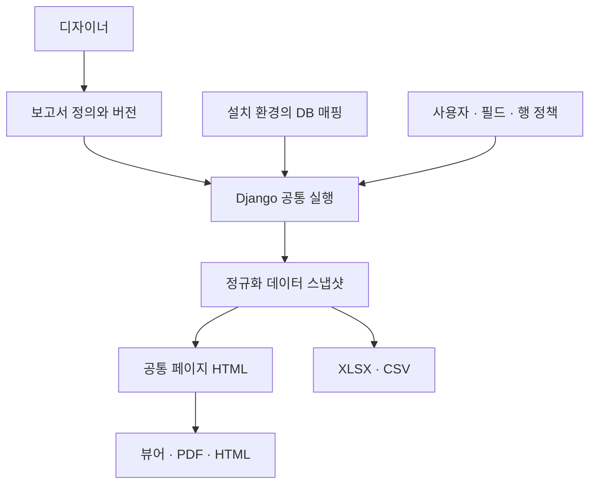

# 쉬운 기술명세 — 구현 버전 0.1.0 alpha

## 1. 제품 구조

사용자는 데이터를 연결한 뒤 논리 필드를 보고서 페이지에 배치합니다. 서버는 권한과 매핑을 확인하고 데이터를 고정한 다음 페이지를 생성합니다.

이 문서는 현재 코드의 동작을 설명합니다. 정식 제품의 전체 목표는 `PLANNED_SPEC_v1.0.md`이며, 두 문서의 완료 범위를 혼동하지 않습니다.

## 2. 사용 기술

Python 3.12+, Django 5.2, SQLAlchemy Core, openpyxl, Pillow, cryptography, 선택 Playwright를 사용합니다. 의존성은 uv가 pyproject.toml/uv.lock으로 관리합니다.

프론트엔드는 Django Template + 로컬 JavaScript/CSS입니다. 실행을 위한 Node 빌드는 필요하지 않습니다. 디자이너는 DOM 요소를 mm 좌표로 배치합니다.

원래 목표의 TypeScript 공통 레이아웃/작업큐 구조와 달리 초기 구현은 **Python 페이지 계산 + 공통 HTML + 동기 HTTP 실행**입니다. 이 선택과 제한은 후속 확대 시 교체 가능한 모듈 경계로 관리합니다.

## 3. 내부 데이터와 원본 데이터

| 데이터 | 보관 위치/용도 |
|---|---|
| 사용자/프로젝트/정의/버전/로그 | 내부 SQLite 또는 PostgreSQL |
| 실제 DB/Excel/Sheets | 외부 자료원 또는 비공개 업로드 파일 |
| 연결 비밀정보 | REPORT_SECRET_KEY로 암호화한 내부 저장 |
| 실행 결과 | 내부 Execution의 정규화 스냅샷/HTML, 보존 기한 적용 |
| 이미지 | 비공개 media, 승인된 API를 통해 제공 |

업무 DB 테이블을 Django 모델로 자동 생성하지 않습니다. 원본 자료원은 커넥터가 읽고 표준 타입으로 변환합니다.

## 4. 논리 계약과 로컬 바인딩

보고서 정의는 실제 테이블명 대신 dataset_id/field_id를 사용합니다. 별도 binding이 로컬 connection ID, 실제 객체/컬럼, 명시 변환을 지정합니다.

| 논리 필드 | 환경 A | 환경 B |
|---|---|---|
| sales.customer | MariaDB.customer_name | Oracle.BUYER_NAME |
| sales.amount | CSV.amount + to_decimal | Oracle.TOTAL_AMOUNT |

같은 의미의 논리 타입을 제공하면 레이아웃을 바꾸지 않고 실행할 수 있습니다. 잘못된 매핑·NULL 정책·변환 손실은 오류로 처리합니다.

정의의 공개 JSON Schema는 `schemas/`에 있습니다. Python `validate_definition`이 참조·범위·논리 ID까지 검사합니다. `validate_parameters`는 데이터 조회 전에 필수값·타입·범위를 검사합니다.

## 5. 쿼리와 커넥터

`data.py`의 public API는 `connector_catalog`, `introspect`, `test_connection`, `execute_dataset`입니다. 선택 자료원 라이브러리는 필요한 때만 import합니다.

현재는 단일 객체에서 제한된 행을 읽은 뒤 메모리 스냅샷에 필터·정렬·그룹·집계·projection을 적용합니다. 원본 행수가 한도를 초과하면 실패하며 부분 데이터로 전체 합계를 계산하지 않습니다.

SQL 값/식별자를 사용자 SQL로 실행하지 않습니다. SQLite는 read-only/query_only, 외부 SQL은 분석된 컬럼과 구조화한 SQLAlchemy 객체를 사용합니다. REST는 승인된 HTTPS 공인 host, IP 검사/고정, redirect 차단을 적용합니다.

JOIN, SQL pushdown, 임의 SQL, REST의 모든 페이지네이션 자동해석은 현재 지원하지 않습니다. 큰 원본은 보고서용 DB VIEW/파일/범위로 줄입니다.

## 6. 페이지 엔진

- fixed 페이지: 표지/양식의 요소 좌표 유지.
- flow 페이지: 데이터셋을 Detail 밴드마다 반복.
- PageHeader/PageFooter: 매 페이지 반복.
- ReportHeader/ReportFooter: flow 템플릿의 시작/끝에서 한 번.
- GroupHeader/GroupFooter: 하나의 연속 그룹과 소계.
- PageBreak: 새 출력 페이지.

지원 요소는 텍스트, 필드, 이미지, 선, 사각형, 페이지/전체 페이지 번호, 매개변수, 생성 시각, 페이지 나누기입니다. 여러 필드를 Detail에 자유배치하여 표 형태 목록을 만듭니다. 독립 DataTable/차트/수식 편집기 요소는 후속 범위입니다.

텍스트 grow는 보수적으로 높이를 추정합니다. 큰 분할 불가 밴드는 오류로 종료합니다. HTML 뷰어와 PDF가 같은 페이지 HTML을 공유하지만 GitHub CI에서 합성 반복 데이터의 PDF 페이지 수·mm 크기·텍스트를 검증했습니다. 다양한 글꼴·긴 텍스트·실제 화면의 시각 검증은 추가로 필요합니다.

## 7. 프로젝트 파일

`.wrpx`는 버전 있는 ZIP입니다. manifest, 프로젝트, 보고서 정의, 논리 계약, 승인된 이미지와 라이선스 설명을 포함합니다.

비밀정보, 연결 ID/문자열, 물리 바인딩, 원본 DB/Excel/Access 파일, 실데이터 스냅샷, 사용자 권한은 기본 내보내기에 포함하지 않습니다.

가져오기는 경로 traversal/symlink/zip bomb/중복/크기/압축률/SHA-256/JSON schema를 검사합니다. 이미지는 raster로 검증하고 새 자산 ID로 바꿉니다. 가져온 보고서는 binding 없이 시작하므로 새 데이터 연결·매핑 후에만 실행합니다.

사용자가 텍스트·이름·필터 상수에 직접 쓴 민감값은 프로젝트에 남을 수 있으므로 공유 전에 확인해야 합니다.

해시는 파일 손상 검사용이며 작성자 신뢰를 증명하는 서명이 아닙니다. 가져온 프로젝트는 실행 가능한 코드로 사용하지 않습니다.

## 8. 버전과 게시

Report는 현재 디자인과 revision 번호를 저장합니다. 저장/바인딩 변경마다 Revision을 생성하고 Publication은 특정 Revision을 참조합니다.

새 수정본 저장이 운영 게시본을 바꾸지 않습니다. 게시 API로 검증한 버전을 변경하거나 이전 revision을 다시 게시합니다. 사용중지/권한 변경 후에는 기존 스냅샷도 다운로드 시 현재 정책을 검사합니다.

## 9. 인증/권한

- 작성자는 자기 보고서를 수정합니다. staff는 관리 기능을 사용합니다.
- viewer_groups는 실행 공유, Connection.groups는 원본 데이터 접근입니다. 두 권한이 필요합니다.
- allowed_objects/allowed_columns는 서버 허용 목록입니다.
- row_policy는 작성자 조건과 AND 결합합니다.
- masks는 `full`/`last4`만 허용하며 알 수 없는 정책은 차단합니다. 데이터 전달 전에 적용하며 조건/정렬/집계로 추론하는 사용을 차단합니다.
- API token은 해시 저장, 사용자·보고서·기능·만료를 제한합니다.
- iframe은 승인 origin의 60초 서명 토큰을 POST로 교환하며 nonce를 DB에서 한 번만 사용합니다.
- CSRF 예외는 검증된 Bearer 인증 API 및 서명 토큰 embed에만 적용합니다. 일반 브라우저 API는 CSRF 보호를 유지합니다.

현재 조직별 workspace SaaS 기능은 없습니다. 소유자/그룹 정책을 통한 단일 설치의 리소스 격리입니다.

## 10. API 요약

prefix `/api/`입니다. 대상 정의의 `/api/v1/`와 달리 초기 구현 경로를 그대로 기재합니다.

| Method/Path | 동작 |
|---|---|
| GET/POST `/connections/` | 허용 연결 목록/관리자 생성 |
| POST `/connections/{id}/test/` | 읽기 연결 테스트 |
| GET `/connections/{id}/schema/` | 허용 객체/컬럼 분석 |
| GET/POST `/reports/` | 보고서 목록/생성 |
| GET/PUT `/reports/{id}/` | 정의/기대 revision 기반 저장 |
| PUT `/reports/{id}/bindings/` | 로컬 매핑 저장 |
| POST `/reports/{id}/preview/` | 작성자 수정본 실행 |
| POST `/reports/{id}/publish/` | 현재/지정 revision 게시 |
| POST `/reports/{id}/execute/` | 게시본 실행 |
| POST `/assets/` | 승인 raster 이미지 업로드 |
| POST `/embed-sessions/` | 범위 제한 iframe 토큰 |

프로젝트 업로드는 `/projects/import/`, 파일 출력은 `/reports/{id}/export/{format}/`입니다. `?execution={id}`를 붙이면 같은 스냅샷을 사용합니다. 에러는 code/message 구조입니다.

현재 XLSX는 Decimal 금액과 날짜/시간을 원값 보존용 문자열 셀로 내보냅니다. Excel 숫자/날짜 셀 및 인쇄 레이아웃 파일은 후속 범위입니다.

현재 snapshot export 경로는 세션 인증용입니다. Bearer API는 게시 실행/정의 읽기/범위 내 편집/임베드 토큰을 지원합니다. 호스트 서버가 결과 HTML을 받아 출력하는 예제는 INTEGRATION.md에 있습니다.

## 11. 기본 제한

- 원본 행수: 10,000 (`REPORT_MAX_ROWS`, 엔진 상한 100,000).
- 파일: 50MiB. 원격 JSON: 20MiB.
- 정의: 2MB, 템플릿 페이지: 100, 필드/요소 수 및 AST 깊이 제한.
- 출력 HTML: 50MB, 출력 페이지: 1,000.
- 서버 파일 결과 재사용: 24시간.

정확한 package 한도는 packaging.py의 상수를 기준으로 합니다. 설정을 높여도 원본 시스템·worker 메모리·응답시간이 자동 확장되는 것은 아닙니다.

## 12. 검증과 다음 단계

Python 데이터/레이아웃/ZIP 검사, Django 인증·매핑·게시·출력·임베드 통합 테스트 및 DOM 디자이너 테스트를 제공합니다. `docs/SUPPORT_MATRIX.md`에서 실제 연결 미검증과 브라우저 검증 제한을 확인하세요.

정식 V1.0 전에는 실제 외부 DB/Sheets/Access 시험, Chromium PDF/폰트 시각검증, JOIN/pushdown, 작업큐/대량 실행, 추가 페이지/표 기능, 의존성 SBOM·배포 지원표 검증을 완료해야 합니다.

## 작업 공간 및 접속 통계

- 전역 사이드바 접기와 라이트/다크 테마는 브라우저에 저장합니다. 리포트 용지 색상은 디자인 설정을 유지합니다.
- 디자이너 전체화면은 툴바와 대화상자를 포함하며 Fullscreen API 미지원 시 CSS 확장 화면을 사용합니다.
- `ReportAccess`는 성공한 열람·실행·임베드 이벤트와 시각, 국가, 기기, 브라우저, OS만 저장합니다. 원본 IP와 User-Agent는 저장하지 않습니다.
- 소유자와 관리자 세션만 통계 JSON 및 XLSX/PDF 내보내기를 사용할 수 있습니다. API 토큰은 허용하지 않습니다.
- 조회 기간은 Asia/Seoul 기준 최대 366일입니다. 화면과 내보내기는 같은 필터 및 집계 함수를 사용합니다. 상세 행 제한은 화면 100건, XLSX 10,000건, PDF 500건이며 초과분 수를 표시합니다.
- 국가 판별은 선택 설치하는 로컬 GeoIP 데이터베이스를 사용합니다. 접속 기록 보관 기간은 `purge_report_access --days 365`로 관리합니다.

설정 및 사용 방법: [작업 공간과 통계 매뉴얼](WORKSPACE_AND_ANALYTICS.md).
